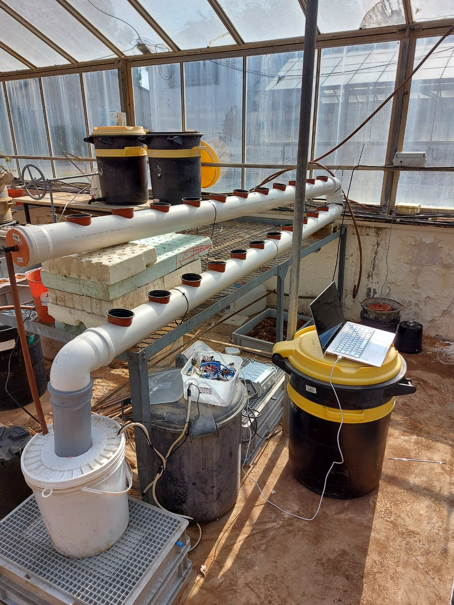
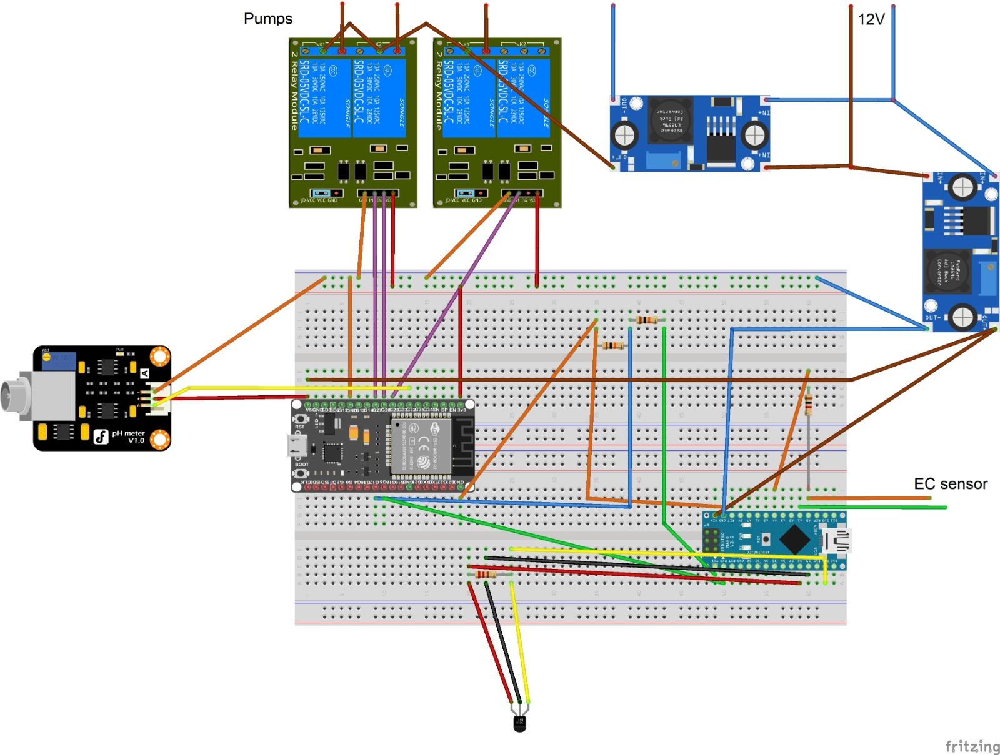

# Hydrophonics Monitoring and Balance by detection
# Introduction

The main purpse of this project is to make a self balanced home and office hydrophonics system, which need one asssembly, one coding and then it's ready to GO!

The system abilities are monitoring EC, Temprature and pH of hydrophonics system and using our peristaltic pumps which connects the balancing solutions to the water tank and what's will keep it in values range that we selected according to our plants.

This project is about making your growing hydrophonics much easier!

!!!*There is currently a problem with the pH sensor, it is unable to be calibrated. After many attempts with different devices from the same model we recommend that you try another model*!!!

# Agri-tech prespection

<ins>EC</ins>

In hydroponics, an EC measurement can be used as an indicator of how many dissolved salts are present, and thus the corresponding strength of a nutrient solution. The most common conductivity meter used in hydroponics is the two-pole sensor. This technology offers a limited range but is relatively inexpensive.

For most plants you want the EC measurement to be hitting between 1.2-1.6 during the vegetative stage and 1.6-2.4 during flowering, but this can be dependent on the type of plant that's growing.

<ins>pH</ins>

A pH test shows whether a substance is acidic or alkaline. The pH scale ranges from 0 to 14, with 0 being the most acidic, 14 the most alkaline, and 7 is the pH-neutral point.

Nutrient solutions used for soilless culture should have a pH between 5 to 6 (usually 5.5), so the pH in the root environment is maintained between 6 to 6.5. This is the pH range at which nutrients are most readily available to plants.

<ins>Temprature</ins>

Nutrient solution temperature influences several important variables, foremost of which are oxygen solubility and plant metabolic processes. With rising temperatures, the rate of metabolic reactions occurring in the plants will increase.

The temperature of the nutrient solution is generally optimum between 15.5° and 26°. Some plants such as lettuce, alstroemeria and strawberries like it near the lower end, whereas tomatoes, cucumbers and cannabis do best near 26° 

# Hardware

<ins>Components and links to order</ins>

  1. 1 X [ESP-32](https://he.aliexpress.com/item/1005003818247483.html?spm=a2g0o.productlist.0.0.755710d1jXgc9F&algo_pvid=285495db-7b43-4cc5-bc67-508cdd252f7d&algo_exp_id=285495db-7b43-4cc5-bc67-508cdd252f7d-15&pdp_ext_f=%7B%22sku_id%22%3A%2212000027263733305%22%7D&pdp_npi=2%40dis%21ILS%21%216.46%21%21%21%21%21%402100bddf16578052994232769e06b1%2112000027263733305%21sea&gatewayAdapt=glo2isr)
  2. 1 X [Arduino NANO](https://he.aliexpress.com/item/1005002998391675.html?spm=a2g0o.productlist.0.0.54e05756lGYh1R&ad_pvid=2022071406290953027619617560000749088_1&s=p&gatewayAdapt=glo2isr)
  3. 2 X [Buck converter (12v to 5v)](https://he.aliexpress.com/item/10000002339702.html?spm=a2g0o.detail.0.0.294b1847SIMREr&gps-id=pcDetailBottomMoreThisSeller&scm=1007.13339.274681.0&scm_id=1007.13339.274681.0&scm-url=1007.13339.274681.0&pvid=ace70ad4-e550-4345-b4ab-54ea09ff477f&_t=gps-id%3ApcDetailBottomMoreThisSeller%2Cscm-url%3A1007.13339.274681.0%2Cpvid%3Aace70ad4-e550-4345-b4ab-54ea09ff477f%2Ctpp_buckets%3A668%232846%238114%231999&pdp_ext_f=%7B%22sku_id%22%3A%2220000000006402560%22%2C%22sceneId%22%3A%223339%22%7D&pdp_npi=2%40dis%21ILS%21%212.27%21%21%21%21%21%40210323b116578058404375704e610c%2120000000006402560%21rec&gatewayAdapt=glo2isr
)
  4. 2 X [Relay - 5v two channel Relay](https://he.aliexpress.com/item/4000674991518.html?UTABTest=aliabtest298352_419680&_randl_currency=ILS&_randl_shipto=IL&src=google&src=google&albch=shopping&acnt=494-037-6276&slnk=&plac=&mtctp=&albbt=Google_7_shopping&albagn=888888&isSmbAutoCall=false&needSmbHouyi=false&albcp=17227132441&albag=142311656371&trgt=297309937645&crea=he4000674991518&netw=u&device=c&albpg=297309937645&albpd=he4000674991518&gclid=CjwKCAjw_b6WBhAQEiwAp4HyIM8hmH9XeiPo0QNMmrY1NCm0EHe1VbSrDzy00FFY65TZhXg7OUFltRoCx0sQAvD_BwE&gclsrc=aw.ds&aff_fcid=fe301d473e5142edbc4bfe168577a351-1657805511283-00898-UneMJZVf&aff_fsk=UneMJZVf&aff_platform=aaf&sk=UneMJZVf&aff_trace_key=fe301d473e5142edbc4bfe168577a351-1657805511283-00898-UneMJZVf&terminal_id=c52e62a381e74c6886088c5b6617a2f0&OLP=1082800308_f_group0&o_s_id=1082800308&afSmartRedirect=y&gatewayAdapt=glo2isr)
  5. 3 X [Paristeltics pumps](https://he.aliexpress.com/item/1005001888639071.html?UTABTest=aliabtest298352_419680&_randl_currency=ILS&_randl_shipto=IL&src=google&src=google&albch=shopping&acnt=494-037-6276&slnk=&plac=&mtctp=&albbt=Google_7_shopping&albagn=888888&isSmbAutoCall=false&needSmbHouyi=false&albcp=17227132441&albag=142311656371&trgt=297309937645&crea=he1005001888639071&netw=u&device=c&albpg=297309937645&albpd=he1005001888639071&gclid=CjwKCAjw_b6WBhAQEiwAp4HyIMU_e4FOBOESbVY6vY1WpouCjl_dG-tpHimhXTTrDFjyNAgjJlNWjxoCnyIQAvD_BwE&gclsrc=aw.ds&aff_fcid=cfa083dc7f11490f8bfc5443c137a2ea-1657805572131-03532-UneMJZVf&aff_fsk=UneMJZVf&aff_platform=aaf&sk=UneMJZVf&aff_trace_key=cfa083dc7f11490f8bfc5443c137a2ea-1657805572131-03532-UneMJZVf&terminal_id=c52e62a381e74c6886088c5b6617a2f0&OLP=1082800308_f_group0&o_s_id=1082800308&afSmartRedirect=y&gatewayAdapt=glo2isr)
  6. 1 X [pH sensor](https://he.aliexpress.com/item/1005001612930856.html?spm=a2g0o.productlist.0.0.76c93260uPpsCb&algo_pvid=6ee9ad07-3560-4422-830a-2d3afe39ee6a&algo_exp_id=6ee9ad07-3560-4422-830a-2d3afe39ee6a-0&pdp_ext_f=%7B%22sku_id%22%3A%2212000016815747832%22%7D&pdp_npi=2%40dis%21ILS%21%2160.86%21%21%21%21%21%402100bdde16578051561284501e60af%2112000016815747832%21sea)
  7. 1 X [Temprature sensor](https://he.aliexpress.com/item/32580791476.html?spm=a2g0o.productlist.0.0.1ef238ddJsnH8J&algo_pvid=201221b0-10fb-49f9-ab89-67882b0cf028&aem_p4p_detail=202207140627549418085009667600002143701&algo_exp_id=201221b0-10fb-49f9-ab89-67882b0cf028-19&pdp_ext_f=%7B%22sku_id%22%3A%2258675593995%22%7D&pdp_npi=2%40dis%21ILS%21%216.21%21%21%2113.63%21%21%402100bb5116578052743317387e6bfa%2158675593995%21sea
)
  8. 2 X [Breadboard](https://he.aliexpress.com/item/1005003640449308.html?spm=a2g0o.search0304.0.0.5fab692f1DqEZK&algo_pvid=a722cf1e-c2ba-4fde-b94f-ef8fe25a6ce9&algo_exp_id=a722cf1e-c2ba-4fde-b94f-ef8fe25a6ce9-14&pdp_ext_f=%7B%22sku_id%22%3A%2212000026608920636%22%7D&pdp_npi=2%40dis%21ILS%21%2117.36%21%21%214.23%21%21%400b0a187b16578059214857204e2875%2112000026608920636%21sea&gatewayAdapt=glo2isr)
  9. 1 X [4.7kΩ Resistor](https://he.aliexpress.com/item/1005002364388450.html?spm=a2g0o.search0304.0.0.43184e63NZIwTJ&algo_pvid=7219ac82-a73d-4a7a-981e-907481b40f16&aem_p4p_detail=202207140640419572926933930500002376166&algo_exp_id=7219ac82-a73d-4a7a-981e-907481b40f16-0&pdp_ext_f=%7B%22sku_id%22%3A%2212000020328334203%22%7D&pdp_npi=2%40dis%21ILS%21%2117.68%21%21%214.23%21%21%402100bb5116578060414966078e6f4d%2112000020328334203%21sea&gatewayAdapt=glo2isr)
  10. 1 X 1kΩ Resistor
  11. 2 X 10kΩ Resistor
  12. [Jumpers a lot!](https://he.aliexpress.com/item/1005003252824475.html?spm=a2g0o.search0304.0.0.5fab692f1DqEZK&algo_pvid=a722cf1e-c2ba-4fde-b94f-ef8fe25a6ce9&algo_exp_id=a722cf1e-c2ba-4fde-b94f-ef8fe25a6ce9-13&pdp_ext_f=%7B%22sku_id%22%3A%2212000024867532507%22%7D&pdp_npi=2%40dis%21ILS%21%2114.17%21%21%211.38%21%21%400b0a187b16578059214857204e2875%2112000024867532507%21sea&gatewayAdapt=glo2isr)
  
 <ins>Circuit Diagram</ins>
 
 

<ins>All the three sensors together</ins>

 

<ins>pH sensor calibartion</ins>

 
  
  
<ins>EC sensor calibartion</ins>
 
   

